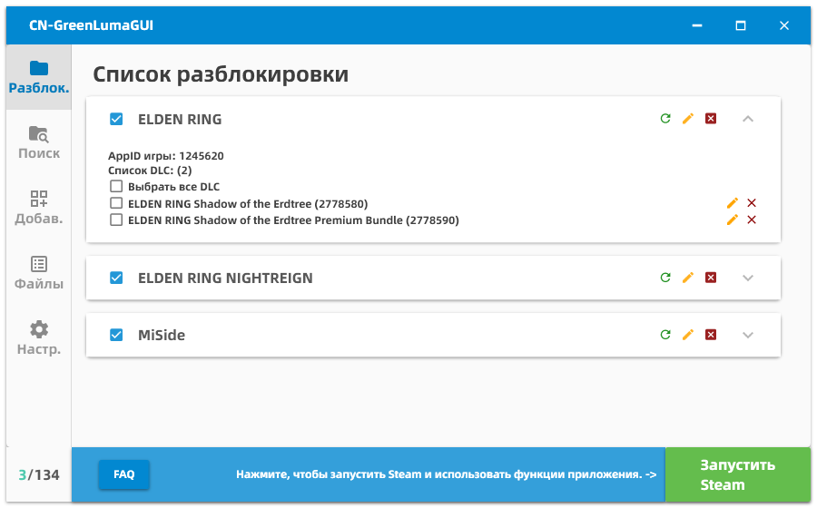
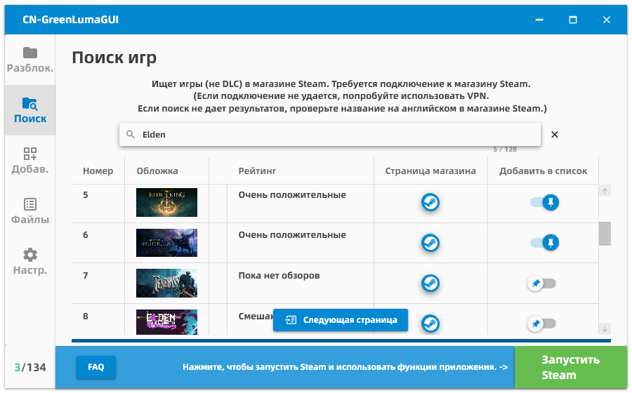
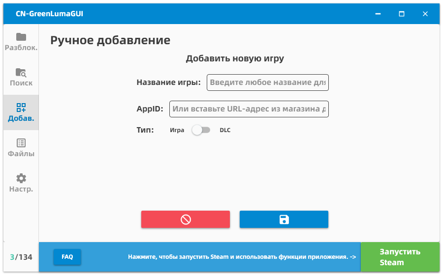
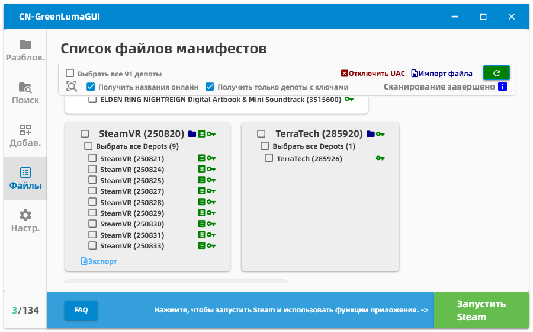

| [简体中文](./README.md) | [English](./README-en-US.md) | [繁體中文](./README-zh-TW.md) | [Русский](./README-ru-RU.md) | [Українська](./README-uk-UA.md) |
| :---: | :---: | :---: | :---: | :---: |

* Этот документ был переведен с помощью Gemini, Qwen и Deepseek. Точность перевода технической терминологии не гарантируется. *

---

# Введение в CN-GreenLumaGUI :

Разработанное с использованием WPF, это приложение управляет папкой списка приложений для инструмента Steam ["GreenLuma"](https://cs.rin.ru/forum/viewtopic.php?f=10&t=103709)

Автономный файл, не требующий установки, позволяет выполнять полные операции простыми щелчками мыши.

Основная цель его создания - позволить друзьям, совершенно незнакомым с компьютерами, использовать GreenLuma для разблокировки игр.

Поскольку он использует WPF, для работы требуется среда выполнения .NET, и он работает исключительно в системах Windows.

## Отображение интерфейса：

## ЧаВо (Часто задаваемые вопросы) :

#### В: Как мне его использовать? Какую кнопку нажимать?

О: Сначала добавьте несколько игр в программу, затем выберите игры, которые хотите разблокировать, в "Списке игр" и нажмите "Запустить Steam". Просто подождите, пока Steam запустится.

Не можете найти кнопку "Запустить Steam"? Возможно, она теперь называется "Закрыть Steam", потому что Steam уже запущен.

* Steam должен быть запущен через кнопку; ручной запуск Steam не считается. Вы можете закрыть это приложение после запуска Steam. *

* Если сначала запустить Steam, а потом выбрать игры - это не сработает. Если вы изменили выбор игр, вам нужно закрыть Steam и затем перезапустить его через программу, чтобы изменения вступили в силу. *

#### В: Можно ли разблокировать эту игру?

О: Я не знаю.

Из-за огромного разнообразия игр невозможно, чтобы я поиграл и протестировал каждую игру, в которую вы можете играть. На вопрос "можно ли играть в определенную игру" единственный критерий - это практика.

Хотя я не могу сказать вам, в какие игры можно играть, я могу сказать, какие точно не будут работать—

Игры, которые перенаправляют на сторонние платформы, точно не будут работать, такие как игры Ubisoft (например, Assassin's Creed) или EA (например, Battlefield).

Онлайн-игры, требующие постоянного подключения к интернету, вероятно, не будут работать (например, Rainbow Six Siege, также игра Ubisoft).

Игры с защитой Denuvo точно не будут работать.

Признаки несовместимости: 

(1) даже при актуальной версии игра постоянно запрашивает обновления, что указывает на то, что она не будет работать, и 

(2) если игра показывает сообщение "ошибка приложения" при запуске, это означает, что она не будет работать.

Однако в особых обстоятельствах некоторые онлайн-игры могут работать — если вы получили общую игру от кого-то другого, и в ней отсутствует проверка, вы потенциально можете присоединиться к онлайн-играм через Steam. Интересно, что большинство однопользовательских игр с мультиплеерными функциями работают таким образом.

Если у меня уже есть общие игры, зачем проходить через этот процесс?

Потому что иногда играть хотите не только вы. Функция Steam "Семейный доступ" на самом деле не делится играми; это больше похоже на выдачу игры взаймы. То есть, если вы поделились своей библиотекой с пятью людьми, только один человек может играть одновременно. Остальные не могут брать игры.

Другими словами, общий доступ к играм Steam позволяет только одному человеку среди вас и пяти друзей играть одновременно. Шесть человек, играющих вместе онлайн, невозможно. Однако, если вы разблокируете игру с помощью этого программного обеспечения, даже если кто-то другой уже играет в нее, пока у вас все еще есть права доступа, вы можете играть нормально.

Конечно, игры, которые разработчик установил как не подлежащие общему доступу в Steam, такие как GTA5, не будут работать.

#### В: Я обнаружил, что в новом Семейном доступе у нас только одна копия игры, и при попытке нескольких человек играть одновременно появляется сообщение о невозможности запуска.

О: Есть четыре возможности.

1: В новой версии Семейного доступа важен порядок игры. Сначала все члены семьи, которые играли в эту игру, должны выйти. Владелец игры не должен ее разблокировать. Вместо этого другие члены семьи, которые не владеют игрой, но хотят играть, должны использовать инструмент для разблокировки и запуска Steam. Тогда все смогут войти в игру вместе.

2: Возможно, обновление Steam уменьшило фактический лимит количества игр, которые можно разблокировать. Попробуйте удалить разблокировки других игр и DLC, чтобы освободить место, затем разблокируйте только игру, в которую хотите играть. Дождитесь обновления программного обеспечения для исправления проблемы.

3: Может быть настоящая проблема с определенными играми, которая потребует обновления DLL-файла от оригинального разработчика. Обычно эти проблемы решаются в следующей версии обновления разработчика. Мне тоже придется подождать этого.

4: Если вы пытаетесь играть в тестовой ветке игры, эта проблема может возникнуть, так как программное обеспечение может не поддерживать тестовые версии.

#### В: Я открыл программу, но не вижу игр в своей библиотеке, или не могу скачать игры из библиотеки, или загрузка завершается мгновенно с пустым пакетом.

О: Это нормальное рабочее состояние программы. Текущая ситуация такова, что функция загрузки не работает.

Если это игра, которой вы или ваша семья владеете, попробуйте выбрать Depot для этой игры в файле манифеста. Альтернативно, вы можете закрыть и Steam, и программу, открыть Steam обычным способом, а затем продолжить загрузку.

Если вы не владеете игрой, попробуйте импортировать файл манифеста и ключ, экспортированные кем-то другим с помощью программы. Затем используйте кнопки Depot в программе, чтобы вручную запустить загрузку. Если у вас нет файла манифеста и ключа, предоставленных кем-то другим, вам придется прибегнуть к облачному хранилищу, другому аккаунту, общему доступу от кого-то другого или другим способам для загрузки игр, в которые хотите играть.

Если вы думали, что эта программа позволит вам скачивать игры, которыми вы не владеете, без каких-либо условий, возможно, вы неправильно поняли ее функциональность.

#### В: Как использовать функции, связанные с Manifest?

> **! Примечание: Текущая версия GreenLuma больше не поддерживает загрузку игр. Для игр с Семейным доступом, пожалуйста, запускайте Steam без инъекции для загрузки. !**

~~Вы можете рассматривать эту страницу как список локально установленных игр, поэтому вам не нужно каждый раз искать в магазине - это самое простое использование.~~

~~Основная цель функциональности Manifest - загрузка игр, но с условиями:~~  
~~1. Кто-то, кто владеет игрой, должен добровольно делиться файлами Manifest и ключами дешифрования с другими.~~  
~~2. Общие Manifest/ключи специфичны для версии и истекают после обновлений игры.~~

~~Базовая загрузка не требует Семейного доступа, что делает ее подходящей для обмена офлайн-однопользовательскими играми между друзьями через Steam, устраняя необходимость отправки целых файлов игр. Для онлайн-игры все равно требуется покупка через Steam.~~

~~Альтернативно, вы можете найти общие Manifest в репозиториях GitHub или нишевых форумах и импортировать их.~~  
~~*(Примечание: Некоторые ключи в формате .st, размещенные на форумах Steamtools, используют неясные правила кодирования и не поддерживаются.)*~~

~~**Для распространителей игр**~~  
~~1. Начните загрузку целевой игры (частичная загрузка допустима, приостановите после начала).~~  
~~2. Откройте программу → Сканировать Manifest → Найдите игру → Нажмите "Экспорт" → Сохраните ZIP-файл.~~  
~~3. Отправьте созданный ZIP другим.~~

~~**Для получателей**~~  
~~1. Перетащите ZIP, содержащий Manifest/ключ, в окно программы, пока не появится "Добавлено успешно".~~  
~~*(Если перетаскивание не удается: Отключите UAC или используйте кнопку "Импорт файла")*~~  
~~2. Запустите Steam через программу. Дождитесь полного запуска.~~  
~~*(Депо автоматически проверяются во время импорта; проверьте вручную, если не отмечены)*~~  
~~3. Откройте "Manifest" → Найдите игру, соответствующую имени ZIP → Нажмите кнопку "Загрузить" рядом с названием игры.~~  
~~*(Критично: Должны нажать кнопку загрузки для правильной игры本体 с соответствующим APPID магазина)*~~

~~**Общие проблемы**~~  

~~##### В: Загрузка завершается мгновенно, но файлы игр пусты~~  
~~О: Manifest не импортирован. Следуйте процессу импорта выше.~~

~~##### В: "Конфигурация игры недоступна" после долгого ожидания~~  
~~О: Нажата не та кнопка загрузки. Используйте только кнопку загрузки для основного депо игры (внешний блок с APPID магазина).~~

~~##### В: Ошибка "Нет лицензии"~~  
~~О: Steam не разблокирован должным образом. Либо:~~  
~~- Запущен Steam без программы~~  
~~- Забыли перезапустить Steam после нового импорта Manifest~~  
~~Решение: Проверьте игру/депо → Перезапустите Steam через программу.~~

~~Если эта проблема возникает часто, это может быть связано с недавним изменением политик Steam или временным сбоем в функции разблокировки программы—требуется будущее обновление для решения.~~

~~##### В: "Контент все еще зашифрован" во время загрузки~~  
~~О: Отсутствует/недействителен ключ дешифрования. Повторно импортируйте правильные файлы Manifest.~~

~~##### В: "Конфигурация контента недоступна"~~  
~~О: Manifest истек. Возможные причины:~~  
~~1. Игра обновлена - старый Manifest недействителен~~  
~~2. Manifest распространителя устарел (требуется недавняя загрузка/обновление)~~  
~~3. Manifest удален после удаления - требуется повторный импорт~~  

~~Редко вызвано проблемами кеша Steam - попробуйте перезагрузку.~~  
~~*Пользователь Lioncky отмечает: Новые игры часто имеют эту проблему из-за оптимизации серверов Steam. Смотрите [эту проблему](https://github.com/clinlx/CN_GreenLumaGUI/issues/42). Общие Manifest могут истекать, если распространитель становится неактивен.*~~

~~##### В: "Нет подключения к интернету" во время загрузки~~
~~О: Если вы уверены, что ваша система на самом деле не отключена, эта ошибка часто связана с той же основной причиной, что и "Конфигурация контента недоступна"—а именно, истекший или недействительный manifest.~~

#### В: В библиотеке показано, что у меня есть DLC, но почему я не могу разблокировать его в игре?

О: Если игра проверяет онлайн, купили ли вы DLC, вы ничего не можете сделать, независимо от того, что показывает Steam.

Для однопользовательских игр чаще всего это происходит потому, что, как упоминалось ранее, по умолчанию нет функции "загрузки DLC".

Некоторые DLC можно разблокировать, потому что для игры это просто маркер. Весь игровой контент уже загружен на ваш компьютер; вам просто нужно обмануть игру, заставив ее думать, что у вас есть DLC, и вы можете играть.

Но для многих игр, если вы не купили DLC, он не загрузит файлы игры. Поскольку вы не можете загрузить, отсутствие файлов игры означает, что даже если игра позволит вам играть в дополнительный контент, вы не сможете играть без этих файлов.

Теоретически, если бы вы могли загрузить DLC, взяв взаймы чужой аккаунт Steam, в котором куплен DLC, тогда вы могли бы играть в него.

#### В: Некоторые DLC разблокированы, как будто обрезаны посередине пакета, с успешными разблокировками до определенной точки и неудачными после.

О: Это может быть связано с обновлением Steam, уменьшившим лимит разблокировок. Вы можете временно исправить это, сняв отметки с других разблокированных элементов, чтобы освободить место для DLC.

В конечном счете, ожидание обновления программного обеспечения должно решить проблему.

#### В: После нажатия кнопки запуска игры, даже если ждать вечность, игра не запускается, зависая на стадии запуска.

О: Режим совместимости имеет небольшую ошибку, но позволяет большему количеству компьютеров нормально запускать Steam. Поэтому я оставил его включенным по умолчанию.

На панели настроек в самом низу отключите режим совместимости и режим администратора. Если после этого вы все еще можете открыть Steam нормально, то вы сможете нормально открыть игру.

#### В: Что делать, если я столкнулся с исключением при запуске с сообщением "Система не может выполнить указанную программу"?

Примечание: В редких случаях это сообщение может появляться на вашем языке (в зависимости от языка системы).

О: Эта проблема, вероятно, связана с Windows Defender. Проверка [этой проблемы](https://github.com/clinlx/CN_GreenLumaGUI/issues/12) может помочь прояснить:

В ней упоминается, что добавление директории "C:\tmp\exewim2oav.addy.vlz" в белый список в Центре безопасности Windows решило проблему.

Однако сначала вы должны убедиться, что необходимая библиотека времени выполнения VC++ установлена правильно.

#### В: Что делать, если я получаю исключение при запуске "Доступ запрещен"?

Примечание: В редких случаях это сообщение может появляться на вашем языке (в зависимости от языка системы).

О: Эта проблема, кажется, возникает довольно часто. Сначала убедитесь, что обновились до последней версии (чтобы подтвердить, что эта проблема все еще существует в текущей версии).

Были решенные случаи раньше, но я знаю только некоторые причины, которые могут не применяться ко всем ситуациям:

1. (Предположение) Непосредственной причиной этой ошибки может быть "недостаточно прав". Действительно может быть проблема с разрешениями, поэтому попробуйте настроить права запуска Steam на "Администратор" внизу страницы настроек.
2. Убедитесь, что необходимая библиотека времени выполнения VC++ установлена правильно.
3. Эта проблема может быть вызвана блокировкой операции сторонним антивирусным ПО. Попробуйте временно отключить его?
4. Если ваша версия системы слишком старая (например, Windows 7) и режим совместимости не включен, это может вызвать проблему.
5. Если вы успешно запускали раньше, но не можете сейчас, возможно, предыдущий процесс не закрылся должным образом и все еще использует файловые ресурсы. Попробуйте перезагрузить компьютер.
6. Если вы проверили все вышеперечисленное и все еще не можете найти причину, последнее средство - попробовать запустить в режиме совместимости, затем выйти из программы и, наконец, вручную запустить C:\tmp\exewim2oav.addy.vlz\DLLInjector_bak.exe, чтобы посмотреть, какую подсказку дает система.

#### В: Почему лимит составляет 134 игры?

О: Поскольку GreenLuma не является открытым исходным кодом (по крайней мере, я не смог найти его исходный код), максимум в 134 разблокировки - это жестко заданный лимит, установленный автором. Причина может быть в том, что GreenLuma нужно подменить ID вашей игры, чтобы обойти проверку Steam, но автор нашел только 134 бесплатные игры (доступные всем), которые можно использовать для замены.

#### В: Я мог использовать эту программу, но внезапно сегодня Steam не появляется, когда я ее открываю.

О: Я тоже сталкивался с этой ситуацией, но не знаю почему. Возможно, Steam завис. Некоторые люди, которых я спрашивал, сказали, что закрытие программы и вход в Steam обычным способом, смена на другой аккаунт или перезагрузка компьютера несколько раз могут решить проблему. Вы можете попробовать эти методы. Поскольку причина не установлена и влияние незначительно, это не преследуется дальше. (Если возникает проблема, сначала проверьте, не могут ли разблокироваться и другие игры, чтобы исключить проблемы, специфичные для игры.)

#### В: Можно ли использовать на неподдерживаемых платформах?

О: Нет. Это невозможно. От оригинального программного обеспечения GreenLuma до DLL-инжектора и WPF - ничто не может использоваться вне платформы Windows.

#### В: Я столкнулся с различными странными проблемами и просто не могу открыть Steam.

О: Я сделал все возможное, чтобы обеспечить установку и работу программы без проблем на всех машинах, которые мог протестировать. Однако странные ошибки все еще многочисленны. В логах я даже видел ошибки из-за "отсутствия cmd.exe в системе Windows", проблему, для которой я не могу найти причину, если только вы не разрешите мне удаленно подключиться к вашему компьютеру, чтобы скомпилировать код и попробовать.

Переключение режима совместимости в настройках может решить некоторые проблемы.

Чтобы обеспечить непрерывность, эта программа напрямую скрывает или отбрасывает многие логи и подсказки GreenLuma, что может повлиять на определение причины проблемы. Таким образом, если все остальное не помогает, вы можете рассмотреть возможность отказа от моей программной оболочки и прямого использования оригинального GreenLuma для запуска Steam, так как это может более четко указать, где заключается проблема.

По любым другим вопросам или нерешенным проблемам, не стесняйтесь отправлять issue на GitHub, чтобы сообщить мне.

## Встроенные файлы :

Для немедленного использования включены следующие файлы (в кодировке base64):

DLLInjector.exe

GreenLuma_2025_x86.dll

## Как вручную заменить внутренние файлы инструмента

Выполните следующие шаги, чтобы инструмент отдавал приоритет вашим собственным файлам:

[1] Создайте папку с именем "override" в директории C:\tmp\exewim2oav.addy.vlz (полный путь C:\tmp\exewim2oav.addy.vlz\override)

[2] Замените DLL-файл: Поместите ваш файл GreenLuma_2025_x86.dll в папку "override", не переименовывая его.

[3] (Опционально) Замените инжектор: Поместите ваш файл DLLInjector.exe в папку "override", также не переименовывая его (это только для обычного режима. Официальный инжектор не используется в "режиме совместимости", поэтому этот шаг не применяется).

[4] (Опционально) Замените конфигурацию инжектора: В папке "override" создайте файл с именем configTemp.ini и заполните его на основе того, как структурирован файл DLLInjector/configTemp.ini в моем репозитории Git. (Опять же, это только для обычного режима. Официальный инжектор не используется в "режиме совместимости", поэтому этот шаг не применяется.)

Инструмент не будет удалять или изменять эту папку. Не забудьте удалить ее позже, если вам больше не нужны замены.

## Используемые библиотеки :

[AngleSharp](https://github.com/AngleSharp/AngleSharp)

[MaterialDesignThemes](https://github.com/MaterialDesignInXAML/MaterialDesignInXamlToolkit)

[Gameloop.Vdf](https://github.com/shravan2x/Gameloop.Vdf)

[Newtonsoft.Json](https://github.com/JamesNK/Newtonsoft.Json)

CommunityToolkit.Mvvm
---
### Заключительное примечание

Этот проект начался как ранняя работа для облегчения игровых сессий с моими друзьями. Пройдя долгий период исправлений и доработок, структура кода несколько запутана, многие реализации логики являются временными решениями, а некоторые функции остаются незавершенными. Он имеет открытый исходный код только для целей общения и обучения.

Этот проект служит исключительно как GUI для GreenLuma. По сравнению с аналогичными проектами, он может иметь следующие недостатки:
*   Требует прав администратора для запуска.
*   Может вызывать ложные срабатывания в антивирусном ПО.
*   Частота кадров может падать при слишком большом количестве файлов игр.
*   Отсутствуют некоторые удобные функции, найденные в аналогичных продуктах, такие как: Управление достижениями, Распаковка игр, Остановка обновлений игр, Обход Denuvo, Прямое использование репозитория Manifest, Сетевое ускорение и т.д.

CN-GreenLumaGUI не стремится быть всеобъемлющим программным обеспечением. Поэтому в будущем не будет крупных функциональных инноваций. Однако он будет поддерживаться в долгосрочной перспективе для исправления ошибок, корректировки переводов и обновлений для соответствия GreenLuma.

Все приветствуются к выпуску работ с аналогичными функциями (я бы тоже с удовольствием ими воспользовался), а модификации или рефакторинг этого проекта также приветствуются.

Спасибо за ваше понимание и поддержку.

С уважением,
**Разработчик CN-GreenLumaGUI**
