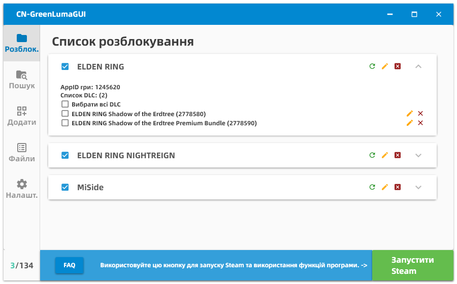
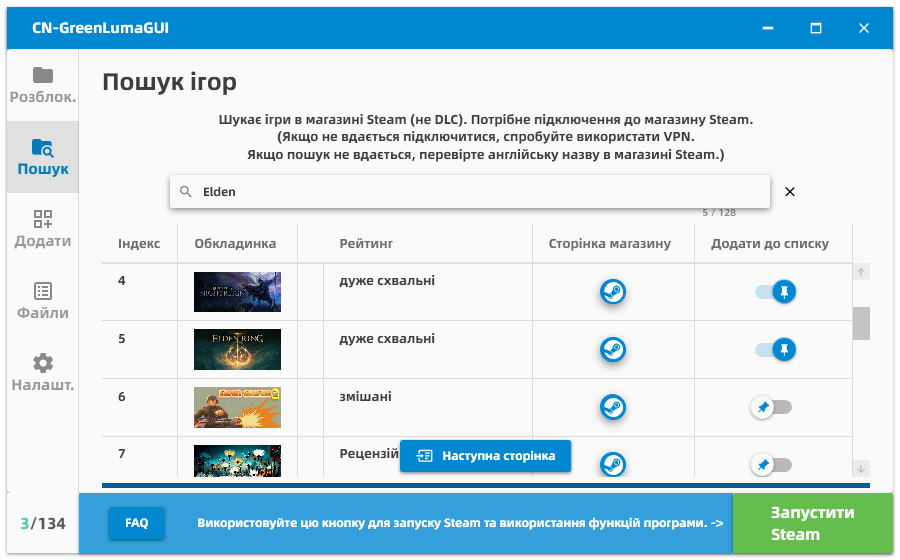
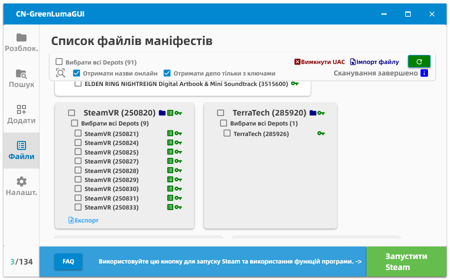

| [简体中文](./README.md) | [English](./README-en-US.md) | [繁體中文](./README-zh-TW.md) | [Русский](./README-ru-RU.md) | [Українська](./README-uk-UA.md) |
| :---: | :---: | :---: | :---: | :---: |

* Цей документ перекладено за допомогою Gemini, Qwen та Deepseek. Точність перекладу технічної термінології не гарантується. *

---

# Вступ до CN-GreenLumaGUI :

Розроблений з використанням WPF, цей додаток керує папкою списку додатків для інструменту Steam ["GreenLuma"](https://cs.rin.ru/forum/viewtopic.php?f=10&t=103709)

Автономний файл, що не вимагає встановлення, дозволяє виконувати повні операції лише клацаннями миші.

Основна мета його створення - дозволити друзям, які зовсім не знайомі з комп'ютерами, використовувати GreenLuma для розблокування ігор.

Оскільки він використовує WPF, для роботи потрібне середовище виконання .NET, і він працює виключно в системах Windows.

## Відображення інтерфейсу：

## ЧаПи (Часті питання) :

#### П: Як мені його використовувати? Яку кнопку натискати?

В: Спочатку додайте кілька ігор у програмі, потім виберіть ігри, які хочете розблокувати, у "Списку ігор" і натисніть "Запустить Steam". Просто зачекайте, поки Steam запуститься.

Не можете знайти кнопку "Запустити Steam"? Можливо, зараз вона називається "Закрити Steam", тому що Steam уже запущений.

* Steam має бути запущений через кнопку; ручний запуск Steam не враховується. Ви можете закрити цей додаток після запуску Steam. *

* Якщо спочатку запустити Steam, а потім вибрати ігри - це не спрацює. Якщо ви змінили вибір ігор, вам потрібно закрити Steam і потім перезапустити його через програму, щоб зміни набули чинності. *

#### П: Чи можна розблокувати цю гру?

В: Я не знаю.

З величезною різноманітністю доступних ігор, для мене неможливо зіграти та протестувати кожну гру, в яку ви можете грати. Щодо питання "чи можна зіграти в певну гру", єдиним критерієм є практика.

Хоча я не можу сказати вам, які ігри можна грати, я можу сказати, які точно не можна—

Ігри, які потребують перенаправлення на сторонню платформу, точно не працюватимуть, такі як Ubisoft (наприклад, Assassin's Creed) або EA (наприклад, Battlefield).

Онлайн-ігри, які вимагають постійного підключення до інтернету, ймовірно, не працюватимуть (наприклад, Rainbow Six Siege, також гра Ubisoft).

Ігри, зашифровані Denuvo, точно не працюватимуть.

Показники несумісності:

*   Гра вимагає стороннього облікового запису для входу.
*   Гра вимагає постійного підключення до інтернету.
*   Гра використовує Denuvo.

Якщо ви не впевнені, просто спробуйте. Якщо працює - працює; якщо ні - то ні.

Однак за особливих обставин деякі онлайн-ігри можуть працювати — якщо ви отримали гру від когось іншого, і вона випадково не має перевірки, ви потенційно можете приєднатися до онлайн-ігор через Steam. Цікаво, що більшість однокористувацьких ігор з багатокористувацькими функціями працюють таким чином.

Якщо у мене вже є спільні ігри, навіщо проходити цей процес?

Тому що іноді грати хоче не тільки ви. Функція Steam "Сімейний доступ" насправді не ділиться іграми; це скоріше схоже на позичання гри. Це означає, що якщо ви поділилися своєю бібліотекою з п'ятьма людьми, лише одна людина може грати одночасно. Решта не мають ігор для позичання.

Іншими словами, спільний доступ до ігор Steam дозволяє лише одній людині серед вас і п'яти друзів грати одночасно. Шість людей, які грають разом онлайн, неможливо. Однак, якщо ви розблокуєте гру за допомогою цієї програми, навіть якщо хтось інший уже грає в неї, доки у вас все ще є привілеї спільного доступу, ви можете грати нормально.

Звичайно, ігри, які розробник встановив як неспільні в Steam, такі як GTA5, не працюватимуть.

#### П: Я виявив, що в новому сімейному доступі у нас є лише одна копія гри, і при спробі кількох людей грати одночасно з'являється повідомлення про неможливість запуску.

В: Є чотири можливості.

1: У новій версії сімейного доступу важливий порядок гри. Спочатку всі члени сім'ї, які грали в цю гру, повинні вийти. Власник гри не повинен її розблоковувати. Натомість інші члени сім'ї, які не володіють грою, але хочуть грати, повинні використовувати інструмент для розблокування та запуску Steam. Тоді всі зможуть увійти в гру разом.

2: Можливо, оновлення Steam зменшило фактичний ліміт кількості ігор, які можна розблокувати. Спробуйте видалити розблокування інших ігор та DLC, щоб звільнити місце, потім розблокуйте лише гру, в яку хочете грати. Дочекайтеся оновлення програмного забезпечення для виправлення проблеми.

3: Може бути справжня проблема з певними іграми, яка вимагатиме оновлення DLL-файлу від оригінального розробника. Зазвичай ці проблеми вирішуються в наступній версії оновлення розробника. Мені теж доведеться почекати на це.

4: Якщо ви намагаєтеся грати в тестовій гілці гри, ця проблема може виникнути, оскільки програмне забезпечення може не підтримувати тестові версії.

#### П: Чи отримаю я VAC-бан?

В: Я не знаю. Я не Valve.

Однак я можу сказати вам, що ця програма не змінює жодних файлів гри. Вона лише змінює пам'ять Steam, щоб він думав, що ви володієте грою. Вона не втручається в роботу гри.

Якщо ви все ще хвилюєтеся, ви можете використовувати окремий обліковий запис Steam.

#### П: Я відкрив програму, але не бачу жодних ігор у своїй бібліотеці, або не можу завантажити ігри зі своєї бібліотеки, або завантаження завершується миттєво з порожнім пакетом.

В: Це нормальний робочий стан програми. Поточна ситуація полягає в тому, що функція завантаження не працює.

Якщо це гра, якою ви або ваша сім'я володієте, спробуйте вибрати Depot для цієї гри у файлі manifest. Альтернативно, ви можете закрити Steam і програму, відкрити Steam звичайним способом, а потім продовжити завантаження.

Якщо ви не володієте грою, спробуйте імпортувати файл manifest і ключ, експортовані кимось іншим за допомогою програми. Потім використовуйте кнопки Depot у програмі, щоб вручну запустити завантаження. Якщо у вас немає файлу manifest і ключа, поділених кимось іншим, вам доведеться вдатися до хмарного сховища, іншого облікового запису, спільного доступу від когось іншого або інших засобів для завантаження ігор, в які ви хочете грати.

Якщо ви думали, що ця програма може дозволити вам завантажувати ігри, якими ви не володієте, без будь-яких умов, ви, можливо, неправильно зрозуміли її функціональність.

#### П: Як використовувати функції, пов'язані з Manifest?

> **! Примітка: Поточна версія GreenLuma більше не підтримує завантаження ігор. Для спільних ігор сім'ї запустіть Steam без ін'єкції для завантаження. !**

~~Ви можете розглядати цю сторінку як список локально встановлених ігор, тому вам не потрібно шукати через сторінку магазину кожного разу - це найпростіше використання.~~

~~Основна мета функціональності Manifest - завантаження ігор, але з умовами:~~  
~~1. Хтось, хто володіє грою, повинен добровільно ділитися файлами Manifest і ключами дешифрування з іншими.~~  
~~2. Спільні Manifests/ключі є версійно-специфічними і закінчуються після оновлення гри.~~

~~Базове завантаження не вимагає сімейного доступу, що робить його придатним для обміну офлайн-однокористувацькими іграми між друзями через Steam, усуваючи необхідність надсилання повних файлів гри. Для онлайн-гри все ще потрібна покупка через Steam.~~

~~Альтернативно, ви можете знайти спільні Manifests у репозиторіях GitHub або нішевих форумах і імпортувати їх.~~  
~~*(Примітка: Деякі ключі у форматі .st, поділені на форумах Steamtools, використовують незрозумілі правила кодування і не підтримуються.)*~~

~~**Для тих, хто ділиться іграми**~~  
~~1. Почніть завантаження цільової гри (часткове завантаження прийнятне, призупиніть після початку).~~  
~~2. Відкрийте програму → Сканування Manifests → Знайдіть гру → Натисніть "Експорт" → Збережіть ZIP-файл.~~  
~~3. Надішліть згенерований ZIP іншим.~~

~~**Для отримувачів**~~  
~~1. Перетягніть ZIP, що містить Manifest/ключ, у вікно програми, доки не з'явиться "Додано успішно".~~  
~~*(Якщо перетягування не вдається: Вимкніть UAC або використовуйте кнопку "Імпорт файлу")*~~  
~~2. Запустіть Steam через програму. Зачекайте повного запуску.~~  
~~*(Автоматично перевірені депо під час імпорту; перевірте вручну, якщо не перевірено)*~~  
~~3. Відкрийте "Manifests" → Знайдіть гру, що відповідає назві ZIP → Натисніть кнопку "Завантажити" поруч із назвою гри.~~  
~~*(Критично: Повинні натиснути кнопку завантаження для правильної гри本体 з відповідним магазинним APPID)*~~

~~**Поширені проблеми**~~  

~~##### П: Завантаження завершується миттєво, але файли гри порожні~~  
~~В: Manifest не імпортовано. Дотримуйтесь процесу імпорту вище.~~

~~##### П: "Конфігурація гри недоступна" після тривалого очікування~~  
~~В: Натиснуто неправильну кнопку завантаження. Використовуйте лише кнопку завантаження для основного депо гри (зовнішня рамка з магазинним APPID).~~

~~##### П: Помилка "Немає ліцензії"~~  
~~В: Steam не розблоковано належним чином. Або:~~  
~~- Steam запущено без програми~~  
~~- Забули перезапустити Steam після імпорту нового Manifest~~  
~~Рішення: Перевірте гру/депо → Перезапустіть Steam через програму.~~

~~Якщо ця проблема виникає часто, це може бути пов'язано з недавньою зміною політик Steam або тимчасовою несправністю функціональності розблокування програми—потрібне майбутнє оновлення для вирішення.~~

~~##### П: "Вміст все ще зашифрований" під час завантаження~~
~~В: Використано неправильний ключ. Ключі є версійно-специфічними і закінчуються після оновлення гри.~~

~~##### П: "Конфігурація вмісту недоступна"~~  
~~В: Manifest закінчився. Можливі причини:~~  
~~1. Гру оновлено - старий Manifest недійсний~~  
~~2. Manifest того, хто ділиться, застарів (потрібне нещодавнє завантаження/оновлення)~~  
~~3. Manifest видалено після видалення гри - потрібен повторний імпорт~~  

~~Рідко викликається проблемами кешу Steam - спробуйте перезавантажити.~~  
~~*Користувач Lioncky зазначає: Нові ігри часто мають цю проблему через оптимізацію серверів Steam. Дивіться [цю проблему](https://github.com/clinlx/CN_GreenLumaGUI/issues/42). Спільні Manifest можуть закінчитися, якщо той, хто ділиться, стає неактивним.*~~

~~##### П: "Немає підключення до інтернету" під час завантаження~~
~~В: Якщо ви впевнені, що ваша система насправді не відключена, ця помилка часто пов'язана з тією ж основною причиною, що й "Конфігурація вмісту недоступна"—а саме, прострочений або недійсний manifest.~~

#### П: Бібліотека показує, що у мене є DLC, але чому я не можу розблокувати його в грі?

В: Якщо гра перевіряє онлайн, чи купили ви DLC, ви нічого не можете зробити, незалежно від того, що показує Steam.

Для однокористувацьких ігор найчастіше це відбувається тому, що, як згадувалося раніше, за замовчуванням немає функції "завантаження DLC".

Деякі DLC можна розблокувати, тому що для гри це просто маркер. Весь ігровий контент вже завантажено на ваш комп'ютер; вам просто потрібно обдурити гру, змусивши її думати, що у вас є DLC, і ви можете грати.

Але для багатьох ігор, якщо ви не купили DLC, він не завантажить файли гри. Оскільки ви не можете завантажити, відсутність файлів гри означає, що навіть якщо гра дозволить вам грати в додатковий вміст, ви не зможете грати без цих файлів.

Теоретично, якби ви могли завантажити DLC, позичивши чужий обліковий запис Steam, у якому куплено DLC, тоді ви могли б грати в нього.

#### П: Деякі DLC розблоковані, ніби обрізані посередині пакета, з успішними розблокуваннями до певної точки і невдалими після.

В: Це може бути пов'язано з оновленням Steam, яке зменшило ліміт розблокувань. Ви можете тимчасово виправити це, знявши позначки з інших розблокованих елементів, щоб звільнити місце для DLC.

Зрештою, очікування оновлення програмного забезпечення повинно вирішити проблему.

#### П: Після натискання кнопки запуску гри, навіть якщо чекати вічність, гра не запускається, зависаючи на стадії запуску.

В: Режим сумісності має невелику помилку, але дозволяє більшій кількості комп'ютерів нормально запускати Steam. Тому я залишив його ввімкненим за замовчуванням.

На панелі налаштувань у самому низу вимкніть режим сумісності та режим адміністратора. Якщо після цього ви все ще можете відкрити Steam нормально, то ви зможете нормально відкрити гру.

#### П: Що робити, якщо я отримую виняток запуску "Система не може виконати вказану програму"?

Примітка: У рідкісних випадках це повідомлення може з'являтися вашою мовою (залежно від мови системи).

В: Ця проблема, ймовірно, пов'язана з Windows Defender. Перевірка [цієї проблеми](https://github.com/clinlx/CN_GreenLumaGUI/issues/12) може допомогти прояснити:

У ній згадується, що додавання директорії "C:\tmp\exewim2oav.addy.vlz" до білого списку в Центрі безпеки Windows вирішило проблему.

Однак спочатку ви повинні переконатися, що необхідна бібліотека часу виконання VC++ встановлена правильно.

#### П: Що робити, якщо я отримую виняток запуску "Відмовлено в доступі"?

Примітка: У рідкісних випадках це повідомлення може з'являтися вашою мовою (залежно від мови системи).

В: Ця проблема, здається, виникає досить часто. Спочатку переконайтеся, що оновилися до останньої версії (щоб підтвердити, що ця проблема все ще існує в поточній версії).

Були вирішені випадки раніше, але я знаю лише деякі причини, які можуть не застосовуватися до всіх ситуацій:

1. (Припущення) Безпосередньою причиною цієї помилки може бути "недостатньо прав". Дійсно може бути проблема з дозволами, тому спробуйте налаштувати права запуску Steam на "Адміністратор" внизу сторінки налаштувань.
2. Переконайтеся, що необхідна бібліотека часу виконання VC++ встановлена правильно.
3. Ця проблема може бути викликана блокуванням операції стороннім антивірусним ПЗ. Спробуйте тимчасово вимкнути його?
4. Якщо ваша версія системи занадто стара (наприклад, Windows 7) і режим сумісності не ввімкнено, це може викликати проблему.
5. Якщо ви успішно запускали раніше, але не можете зараз, можливо, попередній процес не закрився належним чином і все ще використовує файлові ресурси. Спробуйте перезавантажити комп'ютер.
6. Якщо ви перевірили все вищезазначене і все ще не можете знайти причину, останній засіб - спробувати запустити в режимі сумісності, потім вийти з програми і, нарешті, вручну запустити C:\tmp\exewim2oav.addy.vlz\DLLInjector_bak.exe, щоб подивитися, яку підказку дає система.

#### П: Чому ліміт становить 135 гри?

В: Оскільки Greenluma не є відкритим вихідним кодом (принаймні я не зміг знайти його вихідний код), максимум у 135 розблокування - це жорстко заданий ліміт, встановлений автором. Причина може бути в тому, що GreenLuma потрібно підмінити ID вашої гри, щоб обійти перевірку Steam, але автор знайшов лише 135 безкоштовні ігри (доступні всім), які можна використовувати для заміни.

#### П: Я міг використовувати цю програму, але раптом сьогодні Steam не з'являється, коли я її відкриваю.

В: Я теж стикався з цією ситуацією, але не знаю чому. Можливо, Steam завис. Деякі люди, яких я запитував, сказали, що закриття програми і вхід в Steam звичайним способом, зміна на інший обліковий запис або перезавантаження комп'ютера кілька разів можуть вирішити проблему. Ви можете спробувати ці методи. Оскільки причина не встановлена і вплив незначний, це не переслідується далі. (Якщо виникає проблема, спочатку перевірте, чи не можуть розблокуватися й інші ігри, щоб виключити проблеми, специфічні для гри.)

#### П: Чи можна використовувати на платформах, відмінних від Windows?

В: Ні. Це неможливо. Від оригінального програмного забезпечення GreenLuma до DLL-інжектора та WPF - ніщо не може використовуватися поза платформою Windows.

#### П: Я зіткнувся з різними дивними проблемами і просто не можу відкрити Steam.

В: Я зробив усе можливе, щоб забезпечити встановлення та роботу програми без проблем на всіх машинах, які міг протестувати. Однак дивні помилки все ще численні. У логах я навіть бачив помилки через "відсутність cmd.exe в системі Windows", проблему, для якої я не можу знайти причину, якщо тільки ви не дозволите мені віддалено підключитися до вашого комп'ютера, щоб скомпілювати код і спробувати.

Перемикання режиму сумісності в налаштуваннях може вирішити деякі проблеми.

Щоб забезпечити безперервність, ця програма безпосередньо приховує або відкидає багато логів і підказок GreenLuma, що може вплинути на визначення причини проблеми. Таким чином, якщо все інше не допомагає, ви можете розглянути можливість відмови від моєї програмної оболонки і прямого використання оригінального GreenLuma для запуску Steam, оскільки це може більш чітко вказати, де полягає проблема.

З будь-яких інших питань або невирішених проблем, не соромтеся надсилати issue на GitHub, щоб повідомити мене.

## Вбудовані файли :

Для негайного використання включені наступні файли (у кодуванні base64):

DLLInjector.exe

GreenLuma_2026_x86.dll

## Як вручну замінити внутрішні файли інструменту

Виконайте наступні кроки, щоб інструмент надавав пріоритет вашим власним файлам:

[1] Створіть папку з назвою "override" у директорії C:\tmp\exewim2oav.addy.vlz (повний шлях C:\tmp\exewim2oav.addy.vlz\override)

[2] Замініть DLL-файл: Помістіть ваш файл GreenLuma_2026_x86.dll у папку "override", не перейменовуючи його.

[3] (Необов'язково) Замініть інжектор: Помістіть ваш файл DLLInjector.exe у папку "override", також не перейменовуючи його (це тільки для звичайного режиму. Офіційний інжектор не використовується в "режимі сумісності", тому цей крок не застосовується).

[4] (Необов'язково) Замініть конфігурацію інжектора: У папці "override" створіть файл з назвою configTemp.ini і заповніть його на основі того, як структурований файл DLLInjector/configTemp.ini в моєму репозиторії Git. (Знову ж таки, це тільки для звичайного режиму. Офіційний інжектор не використовується в "режимі сумісності", тому цей крок не застосовується.)

Інструмент не буде видаляти або змінювати цю папку. Не забудьте видалити її пізніше, якщо вам більше не потрібні заміни.

## Використані бібліотеки :

[AngleSharp](https://github.com/AngleSharp/AngleSharp)

[MaterialDesignThemes](https://github.com/MaterialDesignInXAML/MaterialDesignInXamlToolkit)

[Gameloop.Vdf](https://github.com/shravan2x/Gameloop.Vdf)

[Newtonsoft.Json](https://github.com/JamesNK/Newtonsoft.Json)

CommunityToolkit.Mvvm
---
### Заключна примітка

Цей проект розпочався як рання робота для полегшення ігрових сесій з моїми друзями. Пройшовши довгий період виправлень і доопрацювань, структура коду дещо заплутана, багато реалізацій логіки є тимчасовими рішеннями, а деякі функції залишаються незавершеними. Він має відкритий вихідний код тільки для цілей спілкування та навчання.

Цей проект служить виключно як GUI для GreenLuma. Порівняно з аналогічними проектами, він може мати наступні недоліки:
*   Вимагає прав адміністратора для запуску.
*   Може викликати помилкові спрацьовування в антивірусному ПЗ.
*   Частота кадрів може падати при занадто великій кількості файлів ігор.
*   Відсутні деякі зручні функції, знайдені в аналогічних продуктах, такі як: Управління досягненнями, Розпакування ігор, Зупинка оновлень ігор, Обхід Denuvo, Пряме використання репозиторію Manifest, Мережеве прискорення тощо.

CN-GreenLumaGUI не прагне бути всеосяжним програмним забезпеченням. Тому в майбутньому не буде великих функціональних інновацій. Однак він буде підтримуватися в довгостроковій перспективі для виправлення помилок, коригування перекладів та оновлень для відповідності GreenLuma.

Всі запрошуються до випуску робіт з аналогічними функціями (я б теж із задоволенням ними скористався), а модифікації або рефакторинг цього проекту також вітаються.

Дякуємо за ваше розуміння та підтримку.

З повагою,
**Розробник CN-GreenLumaGUI**
