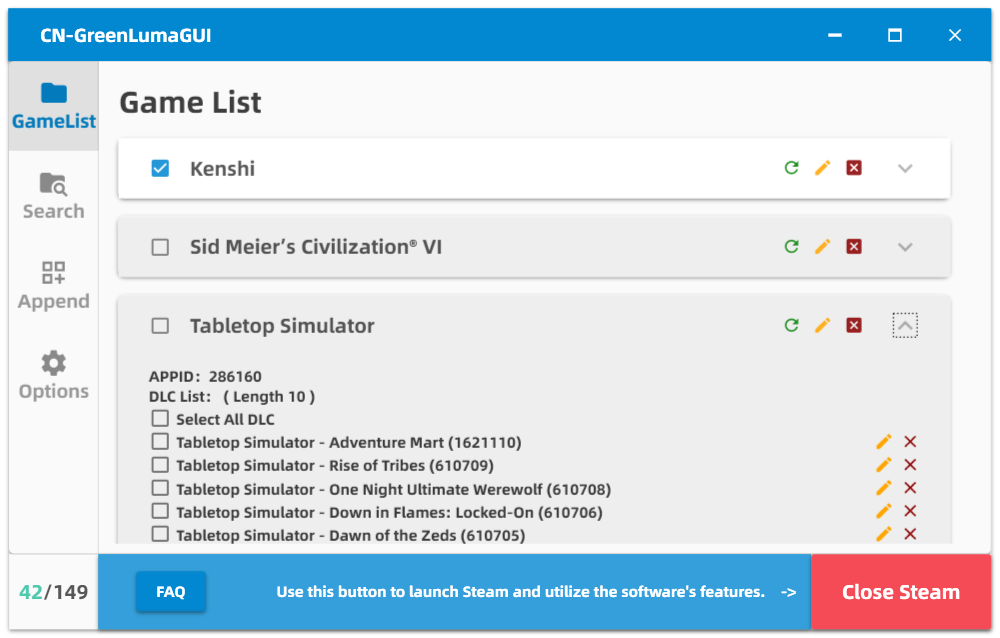
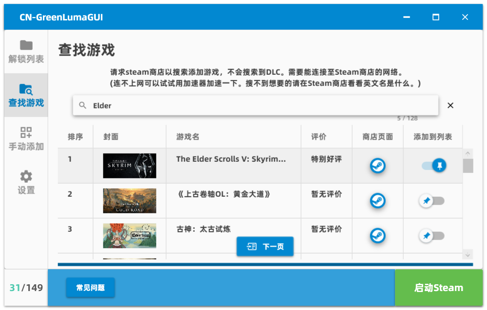
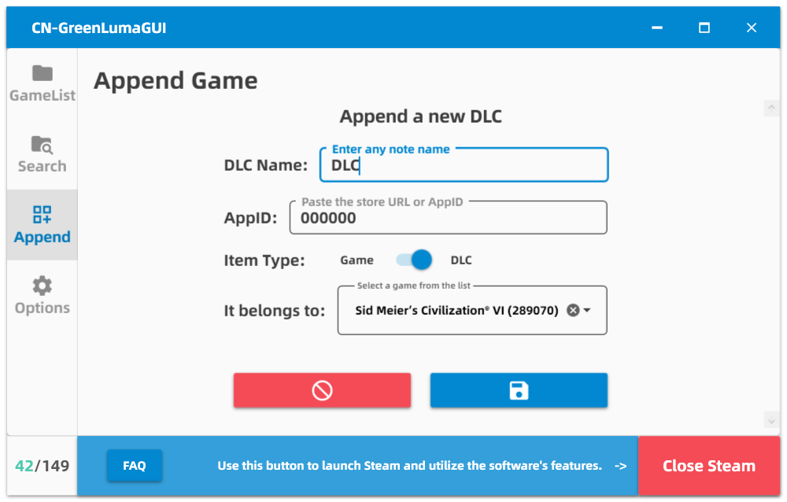
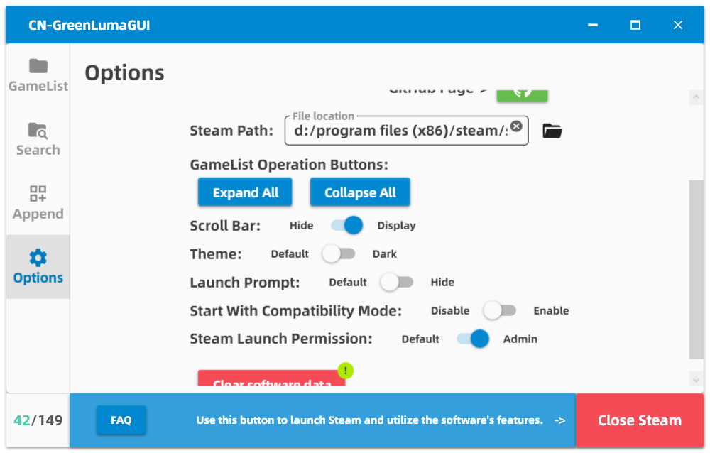

# CN-GreenLumaGUI 簡介 :

[English Doc](https://github.com/clinlx/CN_GreenLumaGUI/blob/master/README-en-US.md)

Github : https://github.com/clinlx/CN_GreenLumaGUI

Gitee : https://gitee.com/clinlx/CN_GreenLumaGUI

GreenLuma 原版工具論壇網址 : https://cs.rin.ru/forum/viewtopic.php?f=10&t=103709

使用 WPF 開發，用於管理 Steam 解鎖工具 ["GreenLuma"](https://cs.rin.ru/forum/viewtopic.php?f=10&t=103709) 應用程式清單資料夾的應用程式
對程式碼不感興趣的可以直接下載編譯完成的檔案: [發佈版本](https://github.com/clinlx/CN_GreenLumaGUI/releases/)

單一檔案，免安裝，除了輸入遊戲名稱外，其他操作全程用滑鼠點擊就能完成

製作核心目的是讓完全不懂電腦的朋友也能操作 GreenLuma 來解鎖遊戲

為了簡單易用，不提供任何參數設定，所以相比其他管理圖形介面，除了介面好看一點點以外一無是處

由於是 WPF，所以需要 .NET 執行階段程式庫，且僅限 Windows 系統下執行

## 介面展示：

## 注意事項 :

請注意請勿使用解鎖功能啟動帶有 VAC 反作弊系統的遊戲！（通常是多人網路遊戲）否則可能導致你在該遊戲中遭到 VAC 封禁！

## 常見問題 :

#### 問: 怎麼用，按哪個按鈕使用？

答：先在軟體裡新增一些遊戲，並在「解鎖清單」選擇你想解鎖的遊戲以後，點一下「啟動 Steam」，然後等著 Steam 啟動就好了。

沒找到「啟動 Steam」這個按鈕？那它現在的名字應該叫「關閉 Steam」，因為你已經開著 Steam 了。

* 必須透過按鈕啟動，自己手動啟動 Steam 是無效的，啟動 Steam 後可以關閉此軟體。 *

* 先啟動 Steam，再勾選遊戲也是不算數的，如果你更改了選擇的遊戲，需要關閉 Steam，然後重新透過軟體執行 Steam 以讓它生效 *

(如果 Steam 已經啟動了，那你就不能再啟動 Steam；只有 Steam 沒有啟動，你才能啟動 Steam；要先關閉 Steam 才能啟動 Steam；如果不關閉 Steam，那你就不能啟動 Steam；如果你關閉了 Steam，那你就只能啟動 Steam。)

#### 問: 某某遊戲能解鎖嗎？

答：我不知道。

天下遊戲浩如煙海，不可能你玩的每一款遊戲我都也玩過，並且測試過。對於「某個遊戲能不能玩」這種問題，我只能說：實踐是檢驗它的唯一標準。

雖然我不能告訴你什麼遊戲可以玩，但是我能告訴你什麼遊戲一定不能玩——

1. 需要跳轉去第三方平台的遊戲一定不行，比如育碧家的遊戲（刺客教條之類的），EA 家的遊戲（戰地風雲之類的）。

2. 必須全程連線的那些網路遊戲大概率不行（比如虹彩六號，而且它同時也是育碧家的遊戲）。

3. D 加密遊戲一定不行。

不行的現象是：(1) 已經是最新的情況下，遊戲一直說要更新就說明不行，(2) 打開遊戲時提示「遊戲啟動時提示應用程式錯誤」就說明不行。

但是特殊情況下，有些連線遊戲卻可以正常工作，這種特殊情況是——如果你實現從別人那裡共享了一個遊戲，恰好這個遊戲沒有做驗證，那你可以透過 Steam 連上網路和別人連線。巧的是，大多數帶多人遊玩功能的單機遊戲就是這樣。

如果我已經有共享遊戲了，那我就能直接玩這個遊戲了，我為什麼還要這麼做？

因為有時候不只你一個人要玩遊戲，~~ Steam 的「遊戲共享」功能並不能分享遊戲，更像「借出」了某個遊戲。也就是說，如果你給 4 個人共享倉庫，在其中一個人玩遊戲的時候，相當於你把倉庫借給了一個人。其他幾個人就沒遊戲可借了。

換句話說，Steam 的遊戲共享，只能讓你和另外 4 個朋友之間，同時只能有一個人玩遊戲。5 個人一起連線是不可能的。但是如果你用軟體解鎖了這個遊戲，即使別人已經借走了遊戲，只要你的共享資格還在，你就能正常玩。

當然，廠商直接在 Steam 上設定過無法共享的遊戲就不行（如 GTA5）~~ 

##### 以上內容是根據舊版家庭共享規則所寫，僅供參考，可能不一定代表真實情況

#### 問: 我發現在新版家庭共享中，我們家庭只有一份遊戲，試著多個人同時玩時提示無法啟動

答: 有四種可能性

1. 在新版家庭共享中，遊玩順序很重要。首先讓所有正在玩這個遊戲的家庭成員退出遊戲。擁有這個遊戲的人不要進行解鎖，其他未擁有這個遊戲但是要玩這個遊戲的人使用工具解鎖打開 Steam。最後所有人再一起進遊戲玩。

2. 可能是 Steam 產生了更新，導致可解鎖遊戲的實際上限降低了。建議取消解鎖其他遊戲和 DLC 來騰空間，然後只解鎖你要的遊戲試試，最後等待軟體進行更新來解決。

3. 可能確實在某些遊戲存在此問題，這個問題的解決要看原作者對 DLL 更新。一般等下一版本原作者的更新會修復一部分此類問題，我也只能等更新。

4. 如果你嘗試遊玩遊戲的測試分支，可能出現此問題，軟體可能不支援測試版

#### 問: 我已經打開了軟體，為什麼庫裡沒有看到遊戲 / 不能下載庫裡的遊戲 / 下載時會瞬間完成且下載空包

答：這就是這款軟體的正常工作狀態。現狀就是下載這個功能不能工作。

如果這是你或者家庭裡的遊戲，嘗試在清單文件中勾選此遊戲的 Depot。或者可以先關閉 Steam 和軟體，透過正常方式打開 Steam，然後就能正常下載了。

如果你根本沒有遊戲，試試導入其他人用軟體導出的清單文件和密鑰，然後用軟體中 Depot 上的按鈕手動觸發下載，如果你也沒有其他人分享給你的清單文件和密鑰，那只能試試用網盤、其他人的帳號，或者從別人那裡共享，或是其他方式下載你想玩的遊戲吧。

如果你覺得這款軟體可以無條件讓你下載你沒有的遊戲，那可能你對這款軟體的功能存在誤解。

#### 問: 本地清單相關功能如何使用？

你可以將這個頁面當成本地已經安裝了遊戲的遊戲列表，這樣你就不用每次都去搜尋頁面找，這是一種簡單用法。

清單功能的真正用途是進行遊戲下載。但並不是無條件的。必須要有某個已經擁有了此遊戲的人，並且自願將清單文件和密鑰分享給其他人，其他人才能進行下載。分享的清單和密鑰僅限一個遊戲版本，會在遊戲更新後失效。

單純的下載是不需要家庭共享的，所以一般用於好友間分享一些離線遊玩的單機遊戲，這樣分享過程可以借助 Steam 間接進行，就不用發送整個遊戲。如果你需要線上遊玩而不是離線遊玩，僅靠清單是做不到的，還是需要在 Steam 進行購買。

或者你也可以在一些 Github 中的清單倉庫或某些小眾的論壇上找到其他人分享的清單，然後導入到軟體中來。(Steamtools 相關論壇上會有一些使用 .st 格式分享的密鑰，由於不清楚其編碼規則，因此不支援導入。)

**對於需要向他人分享遊戲清單的人來說**

第1步：下載你要分享的遊戲，但是不一定要徹底下載完成，可以下載一點點然後暫停。

第2步：打開軟體，掃描本地清單，找到剛剛你要分享的遊戲，點擊「匯出」按鈕，選擇一個目錄儲存。

第3步：將產生的 Zip 壓縮文件發送給其他人。

**對於收到了清單文件的人來說**

第1步：把包含清單和密鑰的 Zip 壓縮包拖進軟體視窗，直到提示新增成功。

(註：若文件無法拖入視窗，則可以透過關閉 UAC 的方式解決，或直接使用「文件導入」按鈕。)

第2步：用軟體解鎖啟動 Steam，等待 Steam 完全啟動後可以進行下一步。

(註：第1步導入時，會自動勾選新增的 Depot，若未勾選則需手動勾選該遊戲的所有 Depot)

第3步：在軟體中點開「本地清單」，找到剛剛和壓縮包同名的遊戲，點擊標題邊上的「下載」按鈕，觸發 Steam 自帶的下載功能

(註：可能下載按鈕有很多，但大部分其實都是無效的，必須找到清單對應的遊戲本體，顯示的 APPID 是和遊戲相同的，然後點擊遊戲本體右邊的「下載」按鈕才行。)

**以下是使用清單功能時可能出現的幾個問題：**

##### 問: 發現下載瞬間完成，並且遊戲是空包，無法遊玩

答：你沒有導入這個遊戲的清單文件。請走上面的流程進行導入。

##### 問: 導入清單後嘗試下載，沒任何反應，很久後會彈窗「遊戲配置文件不可用」

答：一般是你點錯了按鈕。大部分情況下你只需要點擊遊戲本體對應的 depot 右側的下載按鈕即可。(是外層的大框，顯示的 APPID 是和遊戲商店相同的)

##### 問: 導入清單後嘗試下載，彈窗「無許可」

答：如果偶爾出現該問題。可能是你沒有解鎖，比如用自己的方式啟動的 Steam，而沒有透過工具啟動，要麼就是你導入新的清單後忘記了重啟 Steam。請勾選這個遊戲和它的 depots，然後用軟體啟動 Steam。

如果頻繁出現該問題，可能是某天 Steam 的策略有調整，或者軟體的解鎖功能失效了，需要等待更新。

##### 問: 導入清單後嘗試下載，下載的時候出現「內容仍處於加密狀態」

答：你只有清單，沒有清單文件的密鑰，或者密鑰不正確，與你的清單文件無法對應。請重新導入正確的清單文件。

##### 問: 導入清單後嘗試下載，下載的時候出現「內容配置文件不可用」

答：你導入的清單文件已經過期了。如果遊戲發生了更新，那麼舊的清單文件就不再可用了。

如果你的清單是剛剛才匯出的，那說明分享者的清單也是過期的。因為只有在 Steam 進行過下載或更新的時候，清單文件才會更新，因此即使是擁有遊戲的人，如果最近沒有對這款遊戲進行過下載，他的清單也可能不是最新的。

分享者可能需要重新觸發遊戲下載或者更新後，再分享新的清單文件。然後此時接受者對清單進行導入，即可正常下載。

也有可能是你之前卸載了這個遊戲，卸載遊戲後，Steam 會自動刪除本地的清單文件，需要重新導入之前的清單文件才能下載。

~~ 也有另外一種原因：就是 Steam 快取抽風了，暫不清楚詳細原因，先重啟電腦再嘗試可以排除此問題。 ~~

** 根據用戶 Lioncky 指出，新發布的遊戲容易出現該問題，可能與 Steam 下載伺服器的優化機制有關，相關內容可見[此 issue](https://github.com/clinlx/CN_GreenLumaGUI/issues/42)，如果分享者一段時間不使用，則清單文件會失效，接收者必須及時導入。 **

##### 问: 确认网络没问题，其他游戏下载也正常，但是提示“无网络连接”

答：可能与出现“内容配置文件不可用”的原因相同，是清单本身过期了。

#### 問: 明明庫裡面顯示有DLC了，進遊戲為什麼解鎖不了DLC

答：如果遊戲連網去檢查你有沒有買DLC，那沒辦法了，不管你 Steam 裡怎麼顯示的都無濟於事。

對於單機遊戲，更多情況下，是因為和之前說的一樣，預設情況下並沒有「下載DLC」這個功能。

有些DLC可以解鎖，是因為對遊戲來說，這只是一個標記。所有遊戲內容已經下載進你的電腦了，你只要騙過遊戲讓它認為你有DLC，你就能玩。

但更多的遊戲，你不買DLC他就不給你下載遊戲文件。又因為不能下載，所以少了遊戲文件，就算遊戲願意讓你玩額外內容，你也玩不了啊。

理論上，如果你能透過借別人買了DLC的Steam帳號的方式，把DLC下載到你的電腦，那麼你就能玩了。

#### 問: DLC只有一部分被解鎖，就像是在某個DLC截斷了，在某行之前的DLC都成功，而之後的DLC都失敗

可能是因為 Steam 更新導致的解鎖上限減少，可以透過取消掉其他解鎖項目為DLC騰空間來臨時解決。

最終可以透過等待軟體進行更新的方式來解決。

#### 問: 點擊開始遊戲以後，即使等待一萬年，遊戲也沒有啟動，一直卡死在啟動遊戲中。

答：相容模式有一點小Bug，但是可以讓更多的電腦正常啟動 Steam。所以我預設讓它開著了。

在設定面板最底下，關閉相容模式和管理員模式，如果你此時還能正常打開 Steam，就能正常打開這個遊戲了。

#### 問: 網路異常怎麼解決

答：這個軟體的搜尋功能其實就是偷偷在後台打開 Steam 商店的網頁搜了一下，你可以看看是不是能正常上網頁版 Steam。

用一些加速 Steam 商店的軟體可以解決問題。如果你是用的梯子，記得打開全域模式試試。

如果你使用了加速器，又打開了設定裡面的「加速Steam搜尋」功能，那就在設定裡關掉這個功能。

如果不管怎麼調加速器，無論怎麼樣做，都沒有效果？你還是用手動新增吧。

#### 問: 網路正常，搜尋功能正常，但是搜不到某個遊戲

答：這個軟體的搜尋功能其實就是偷偷在後台打開 Steam 商店的網頁搜了一下，可以多試試英文名全稱搜尋，或者直接把商店地址放進搜尋欄。

正因為是網頁版 Steam，所以 Steam 商店的鎖區也適用。被鎖區的遊戲還是用手動新增吧。

#### 問: 啟動異常請聯繫管理員(The system cannot execute the specified program.)

*註：少數情況下也出現中文(系統無法執行指定的程序。)*

答：大概率是 Windows 預設防毒軟體的鍋，查看[此 issue](https://github.com/clinlx/CN_GreenLumaGUI/issues/12)或許可以解答你的疑惑:

他提到將目錄「C:\tmp\exewim2oav.addy.vlz」新增到 Windows 安全中心的白名單後問題解決了。

不過你要先確保前置的 VC++ 運行庫正常安裝

#### 問: 啟動異常請聯繫管理員(Access is denied.)

*註：少數情況下也出現中文(訪問被拒絕)*

答：我發現這也是一個出現得比較多的問題，首先先更新到最新版(確認這個問題在至今的版本依然存在)

之前已經有解決的案例，但是我只知道部分原因，不一定適用於所有情況：

1. (猜測)這個錯誤的直接原因可能是「權限不夠」，可能確實存在權限問題，所以在設定頁面的最底部，將 Steam 啟動權限調整為「管理員」試試？
2. 前置的 VC++ 運行庫是否正常安裝了？
3. 這個問題可能是其他第三方的防毒軟體(如360)阻止了這個操作。暫時關閉試試？
4. 如果系統版本過老(如 Windows7)但是又沒開啟相容模式，可能導致這個問題。(但是新版本的軟體應該會幫你自動打開的)
5. 如果之前成功啟動過，而現在不行，可能之前的程序沒能正常關閉，導致還在佔用文件資源，重啟電腦試試？
6. 如果上面的排查都找不到原因，最終的解決辦法：先用相容模式嘗試啟動，然後退出軟體，最後手動執行一下 C:\tmp\exewim2oav.addy.vlz\DLLInjector_bak.exe 試試，看看系統到底會彈出什麼提示。

#### 問: 為什麼數量上限是130個

答：因為 Greenluma 並不開源，最多只能解鎖130個是作者寫在程式裡的硬限制，原因未知。以前是不限制的，後來應該原作者是遇到了什麼 BUG 所以做此限制。我無法解決。

#### 問: 之前一直都能用這個軟體，但是今天打開突然就不彈出 Steam 了

答：我也遇到過這種情況，但是我不知道為什麼，可能 Steam 卡住了。我問過幾個人，他們說關閉這個軟體，用正常方式登入一下 Steam，換個帳號登入一下 Steam，或是重啟電腦幾次就自己恢復正常了。你也可以試試，由於這個問題找不到原因，又影響不大所以就不深究了。（如果出現問題，第一時間檢查下其他遊戲是不是也不能解鎖，排除下是不是和遊戲種類相關。）

#### 問: 非 Windows 平台能用嗎

答：不可以。做不到。從 GreenLuma 原軟體，到 DLL 注入器，再到 WPF，三者都不可能脫離 Windows 平台使用。

#### 問: 我遇到了各種奇奇怪怪的問題，總之打不開 Steam

答：我已經盡量做到，讓我能遇到的機器都安裝一遍，保證沒出問題了。但是奇怪的 BUG 還是很多，我在日誌裡甚至能看到有人因為「windows 系統裡面沒有 cmd.exe」而出錯，遇到這種問題我也找不到原因，除非你讓我遠端到你電腦上編譯程式碼試試。

一般在設定裡切換相容模式可以解決一部分問題。

這個為了保證不割裂，我這個軟體會直接隱藏甚至丟棄很多 GreenLuma 的日誌和提示，可能影響找出發生問題的原因。因此再不行可以直接放棄我這個套殼軟體，用原版 GreenLuma 啟動一下 Steam 可能更能看出問題出在哪了。

*任何其他疑問或遇到無法解決的問題，可以到 Github 提交 issue 告知我。*

## 內置文件 :

為了點擊即用，內置了以下文件:（以 base64 編碼的形式存在）

DLLInjector.exe

GreenLuma_2025_x86.dll (版本 GreenLuma_2025_1.6.7)

## 如何手動替換工具的內置文件

透過以下步驟可以讓工具優先使用你自己提供的文件：

[1] 在 C:\tmp\exewim2oav.addy.vlz 目錄下建立資料夾 override (完整路徑 C:\tmp\exewim2oav.addy.vlz\override )

[2] 替換 dll 文件: 將你從官方論壇解壓出來的 GreenLuma_2025_x86.dll 文件放入 override 資料夾下，不要改名

[3] (可選) 替換注入器: 將你從官方論壇解壓出來的 DLLInjector.exe 文件放入 override 資料夾下，不要改名 (僅限普通模式。在「相容模式」下不使用官方注入器，因而無效)

[4] (可選) 替換注入器配置: 在 override 資料夾下，建立文件 configTemp.ini ，然後參考我 Git 上面 DLLInjector/configTemp.ini 文件的方式填寫。 (僅限普通模式。在「相容模式」下不使用官方注入器，因而無效)

工具不會刪除或修改這個資料夾，如果你之後不再需要進行替換，記得刪除該資料夾

## 免責聲明

該倉庫下的所有電腦程式和原始碼僅供學習和研究使用。其旨在為學習人員提供參考和資料，任何其他目的均不適用。

如果您發現某個程式或遊戲對您有幫助或您喜歡它，請積極支持正版。購買和註冊正版軟體不僅可以獲取官方的支援和更新，而且可以享受更多的功能和服務。

對該軟體的使用可能帶來潛在的風險，應當由使用者自行承擔。該風險涉及不確定性，並且可能會隨著時代的變化而發生變化。使用軟體前請確認自己已經自行了解其中的風險，並確保自願承擔其風險。

無論是由於軟體，使用或其他方式產生的，與之有關或與之有關的合約，侵權或其他形式的任何索賠，損害或其他責任，開發者或貢獻者對因使用專案而造成的損失不承擔任何責任。

## 使用的函式庫 :

[AngleSharp](https://github.com/AngleSharp/AngleSharp)

[MaterialDesignThemes](https://github.com/MaterialDesignInXAML/MaterialDesignInXamlToolkit)

[Gameloop.Vdf](https://github.com/shravan2x/Gameloop.Vdf)

CommunityToolkit.Mvvm

Newtonsoft.Json
