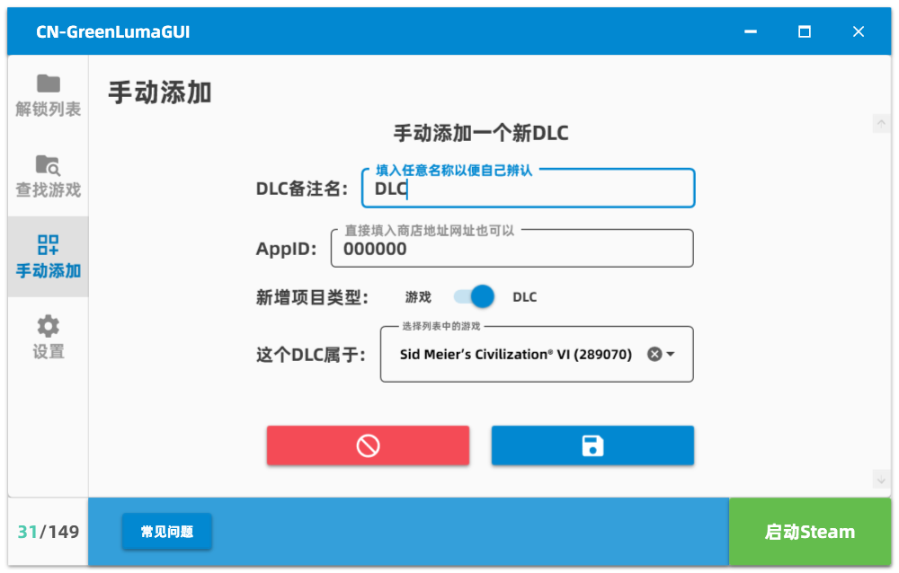

# CN-GreenLumaGUI 简介 :

[English Doc](https://github.com/clinlx/CN_GreenLumaGUI/blob/master/README-EN.md)

Github : https://github.com/clinlx/CN_GreenLumaGUI

Gitee : https://gitee.com/clinlx/CN_GreenLumaGUI

GreeLuma 原工具论坛地址 : https://cs.rin.ru/forum/viewtopic.php?f=10&t=103709

用WPF开发，用于管理 Steam 解锁器 [“GreenLuma”](https://cs.rin.ru/forum/viewtopic.php?f=10&t=103709) 应用列表文件夹的应用程序
对代码不感兴趣的可以直接下载编译完成的文件: [Releases](https://github.com/clinlx/CN_GreenLumaGUI/releases/)

蓝奏云(密码:1234): [下载](https://wwoo.lanzouk.com/b01qylrza)

单文件，免安装，除了输入游戏名，其他全程用鼠标点点点就能完成操作

制作核心目的是让完全不懂电脑的朋友也能操作GreenLuma来解锁游戏

为了简单易用，不提供任何参数设置，所以相比其他管理图形界面，除了界面好看一点点以外一无是处

由于是WPF，所以需要.net运行库，且仅限Windows系统下运行

## 界面展示：

## 注意事项 :

注意请勿使用解锁启动带有VAC反作弊系统的游戏!(一般是多人网络游戏)否则可能导致你在该游戏中遭到VAC封禁!

## 常见问题 :

#### 问: 怎么用，按哪个按钮使用？

答：先在软件里添加一些游戏，并在“解锁列表”选择你想解锁的游戏以后，点一下“启动Steam”，然后等着Steam启动就好了。

没找到“启动Steam”这个按钮？那它现在的名字应该叫“关闭Steam”，因为你已经开着Steam了。

* 必须通过按钮启动，自己手动启动steam是无效的，启动Steam后可以关闭此软件。 *

* 先启动Steam，再勾选游戏也是不算数的，如果你更改了选择的游戏，需要关闭Steam，然后重新通过软件运行Steam以让它生效 *

(如果Steam已经启动了，那你就不能再启动Steam；只有Steam没有启动，你才能启动Steam；要先关闭Steam才能启动Steam；如果不关闭Steam，那你就不能启动Steam；如果你关闭了Steam，那你就只能启动Steam。)

#### 问: 某某游戏能解锁吗？

答：我不知道。

天下游戏浩如烟海，不可能你玩的每一款游戏我都也玩过，并且测试过。对于"某个游戏能不能玩"这种问题，我只能说：实践是检验它的唯一标准。

虽然我不能告诉你什么游戏可以玩，但是我能告诉你什么游戏一定不能玩——

1.需要跳转去第三方平台的游戏一定不行，比如育碧家的游戏，(刺客信条之类的)，EA家的游戏(战地之类的)。

2.必须全程联网的那些网络游戏大概率不行(比如彩虹六号，而且它同时也是育碧家的游戏)。

3.D加密游戏一定不行。

不行的现象是:(1)已经是最新的情况下，游戏一直说要更新就说明不行，(2)打开游戏时提示“游戏启动时提示应用错误”就说明不行。

但是特殊情况下，有些联网游戏却可以正常工作，这种特殊情况是——如果你实现从别人那里共享了一个游戏，恰好这个游戏没有做验证，那你可以通过Steam连上网络和别人联机。巧的是，大多数带多人游玩功能的单机游戏就是这样。

如果我已经有共享游戏了，那我就能直接玩这个游戏了，我为什么还要这么做？

因为有时候不只你一个人要玩游戏，~~ Steam的“游戏共享”功能并不能分享游戏，更像“借出”了某个游戏。也就是说，如果你给4个人共享仓库，在其中一个人玩游戏的时候，相当于你把仓库借给了一个人。其他几个人就没游戏可借了。

换句话说，Steam的游戏共享，只能让你和另外4个朋友之间，同时只能有一个人玩游戏。5个人一起联机是不可能的。但是如果你用软件解锁了这个游戏，即使别人已经借走了游戏，只要你的共享资格还在，你就能正常玩。

当然，厂商直接在Steam上设置过无法共享的游戏就不行(如GTA5) ~~ 

##### 以上内容是根据旧版家庭共享规则所写，仅供参考，可能不一定代表真实情况

#### 问: 我发现在新版家庭共享中，我们家庭只有一份游戏，试着多个人同时玩时提示无法启动

答: 确实在某些游戏存在此问题，这个问题的解决要看原作者对DLL更新。一般等下一版本原作者的更新会修复一部分此类问题，我也只能等更新。

#### 问: 我已经打开了软件，为什么库里没有看到游戏 / 不能下载库里的游戏

答：这就是这款软件的正常工作状态。现状就是下载这个功能不能工作。

如果你觉得这款软件可以让你下载你没有的游戏，那可能你对这款软件的功能存在误解。

关闭软件，正常打开Steam，用网盘、其他人的账号，或者从别人那里共享，或是其他方式下载你想玩的游戏吧。

注意：只有关闭软件，使用普通方法启动Steam的的情况下才能正常下载游戏。否则只会下载失败，或者瞬间下载完成一个无法打开的空包。

#### 问: 明明库里面显示有DLC了，进游戏为什么解锁不了DLC

答：如果游戏联网去检查你有没有买DLC，那没办法了，不管你Steam里怎么显示的都无济于事。

对于单机游戏，更多情况下，是因为和之前说的一样，并没有“下载”这个功能。

有些DLC可以解锁，是因为对游戏来说，这只是一个标记。所有游戏内容已经下载进你的电脑了，你只要骗过游戏让它认为你有DLC，你就能玩。

但更多的游戏，你不买DLC他就不给你下载游戏文件。又因为不能下载，所以少了游戏文件，就算游戏愿意让你玩额外内容，你也玩不了啊。

理论上，如果你能通过借别人买了DLC的Steam账号的方式，把DLC下载到你的电脑，那么你就能玩了。

#### 问: 点击开始游戏以后，即使等待一万年，游戏也没有启动，一直卡死在启动游戏中。

答：兼容模式有一点小Bug，但是可以让更多的电脑正常启动Steam。所以我默认让它开着了。

在设置面板最底下，关闭兼容模式和管理员模式，如果你此时还能正常打开Steam，就能正常打开这个游戏了。

#### 问: 网络异常怎么解决

答：这个软件的搜索功能其实就是偷偷在后台打开Steam商店的网页搜了一下，你可以看看是不是能正常上网页版Steam。

用一些加速Steam商店的软件可以解决问题。如果你是用的梯子，记得打开全局模式试试。

如果你使用了加速器，又打开了设置里面的“加速Steam搜索”功能，那就在设置里关掉这个功能。

如果不管怎么调加速器，无论怎么样做，都没有效果？你还是用手动添加吧。

#### 问: 网络正常，搜索功能正常，但是搜不到某个游戏

答：这个软件的搜索功能其实就是偷偷在后台打开Steam商店的网页搜了一下，可以多试试英文名全称搜索，或者直接把商店地址放进搜索栏。

正因为是网页版Steam，所以Steam商店的锁区也适用。被锁区的游戏还是用手动添加吧。

#### 问: 启动异常请联系管理员(The system cannot execute the specified program.)

*注：少数情况下也出现中文(系统无法执行指定的程序。)*

答：大概率是Windows默认杀毒软件的锅，查看[此issue](https://github.com/clinlx/CN_GreenLumaGUI/issues/12)或许可以解答你的疑惑:

他提到将目录“C:\tmp\exewim2oav.addy.vlz”添加到Windows安全中心的白名单后问题解决了。

不过你要先确保前置的VC++运行库正常安装

#### 问: 启动异常请联系管理员(Access is denied.)

*注：少数情况下也出现中文(访问被拒绝)*

答：我发现这也是一个出现得比较多的问题，首先先更新到最新版(确认这个问题在至今的版本依然存在)

之前已经有解决的案例，但是我只知道部分原因，不一定适用于所有情况：

1. (猜测)这个错误的直接原因可能是“权限不够”，可能确实存在权限问题，所以在设置页面的最底部，将Steam启动权限调整为“管理员”试试？
2. 前置的VC++运行库是否正常安装了？
3. 这个问题可能是其他第三方的杀毒软件(如360)阻止了这个操作。暂时关闭试试？
4. 如果系统版本过老(如Windows7)但是又没开启兼容模式，可能导致这个问题。(但是新版本的软件应该会帮你自动打开的)
5. 如果之前成功启动过，而现在不行，可能之前的进程没能正常关闭，导致还在占用文件资源，重启电脑试试？
6. 如果上面的盘排查都找不到原因，最终的解决办法：先用兼容模式尝试启动，然后退出软件，最后手动运行一下C:\tmp\exewim2oav.addy.vlz\DLLInjector_bak.exe试试，看看系统到底会弹出什么提示。

#### 问: 为什么数量上限是129个

答：因为Greenluma并不开源，最多只能解锁129个是作者写在程序里的硬限制，原因未知。以前是不限制的，后来应该原作者是遇到了什么BUG所以做此限制。我无法解决。

#### 问: 之前一直都能用这个软件，但是今天打开突然就不弹出Steam了

答：我也遇到过这种情况，但是我不知道为什么，可能Steam卡住了。我问过几个人，他们说关闭这个软件，用正常方式登录一下Steam，换个账号登录一下Steam，或是重启电脑几次就自己恢复正常了。你也可以试试，由于这个问题找不到原因，又影响不大所以就不深究了。（如果出现问题，第一时间检查下其他游戏是不是也不能解锁，排除下是不是和游戏种类相关。）

#### 问: 非Windows平台能用吗

答：不可以。做不到。从GreenLuma原软件，到DLL注入器，再到WPF，三者都不可能脱离Windows平台使用。

#### 问: 我遇到了各种奇奇怪怪的问题，总之打不开Steam

答：我已经尽量做到，让我能遇到的机器都安装一遍，保证没出问题了。但是奇怪的BUG还是很多，我在日志里甚至能看到有人因为“windows系统里面没有cmd.exe”而出错，遇到这种问题我也找不到原因，除非你让我远程到你电脑上编译代码试试。

一般在设置里切换兼容模式可以解决一部分问题。

这个为了保证不割裂，我这个软件会直接隐藏甚至丢弃很多GreenLuma的日志和提示，可能影响找出发生问题的原因。因此再不行可以直接放弃我这个套壳软件，用原版GreenLuma启动一下Steam可能更能看出问题出在哪了。

*任何其他疑问或遇到无法解决的问题，可以到Github提交issue告知我。*

#### 问: 好垃圾的软件，有什么用。

答: 是的，如果你觉得不需要用，那就不要用。因为我做它的理念就是：完全不联网的情况下，功能也齐全。你也不用总是更新它。

所以像是“下载游戏”这种功能？要搭设大带宽服务器，所以没有这个功能。

所以像是“清单密钥分享”这种功能？要搭设服务器存密钥这种隐私数据，所以没有这个功能。

因为没有这些功能，我技术也差，所以和这软件和Steamtools这些常用工具就有了本质上的差别，就没法相提并论了。

## 内置文件 :

为了点击即用，内置了以下文件:（以base64编码的形式存在）

DLLInjector.exe

GreenLuma_2024_x86.dll (版本GreenLuma_2024_1.5.9)

## 免责声明

该仓库下的所有计算机程序和源码仅供学习和研究使用。其旨在为学习人员提供参考和资料，任何其他目的均不适用。

如果您发现某个程序或游戏对您有帮助或您喜欢它，请积极支持正版。购买和注册正版软件不仅可以获取官方的支持和更新，而且可以享受更多的功能和服务。

对该软件的使用可能带来潜在的风险，应当由使用者自行承担。该风险涉及不确定性，并且可能会随着时代的变化而发生变化。使用软件前请确认自己已经自行了解其中的风险，并确保自愿承担其风险。

无论是由于软件，使用或其他方式产生的，与之有关或与之有关的合同，侵权或其他形式的任何索赔，损害或其他责任，开发者或贡献者对因使用项目而造成的损失不承担任何责任。

## 使用的库 :

[AngleSharp](https://github.com/AngleSharp/AngleSharp)

[MaterialDesignThemes](https://github.com/MaterialDesignInXAML/MaterialDesignInXamlToolkit)

CommunityToolkit.Mvvm

Newtonsoft.Json